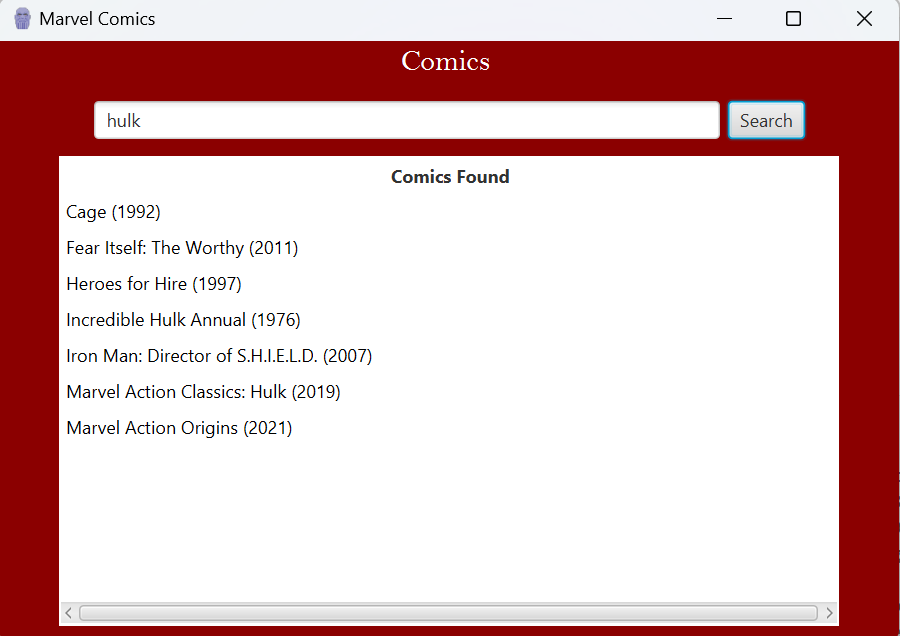
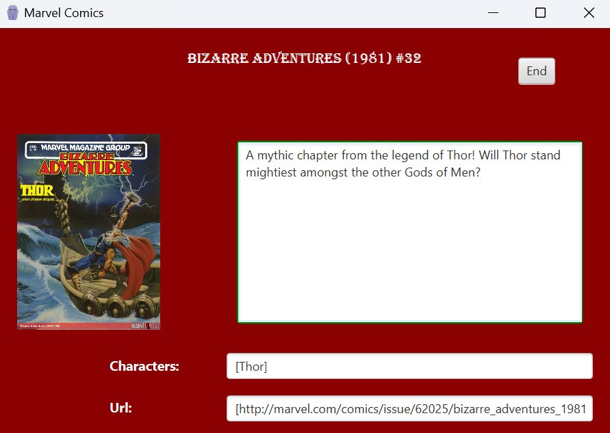

# Marvel Comics Search and Viewer

## Description
This JavaFX application allows users to search for Marvel comics by character name and view detailed information about the selected comic. The application utilizes the Marvel Comics API to fetch comic data such as titles, descriptions, thumbnails, characters, and URLs.

## Features
- Search for Marvel comics by character name.
- View comic titles in a table.
- Double-click on a comic title to view detailed information about the comic.
- Display comic title, description, thumbnail, characters, and URLs in a separate view.

## Usage
1. Clone the repository: git clone https://github.com/your-username/marvel-comics-search.git
2. Open the project in your preferred Java IDE.
3. Run the `Main` class to launch the application.
4. Enter a Marvel character name in the search box and click the "Search" button.
5. Double-click on a comic title in the table to view detailed information about the comic.

## Dependencies
- Java 11 or higher
- json-simple library for JSON parsing
- JavaFX SDK

## Installation
To use this project, ensure that you have Java 11 or higher installed on your system. Additionally, include the `json-simple` library in your project dependencies and set up the JavaFX SDK.

## Screenshots

